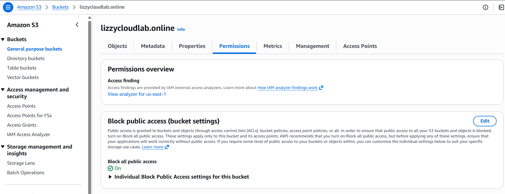
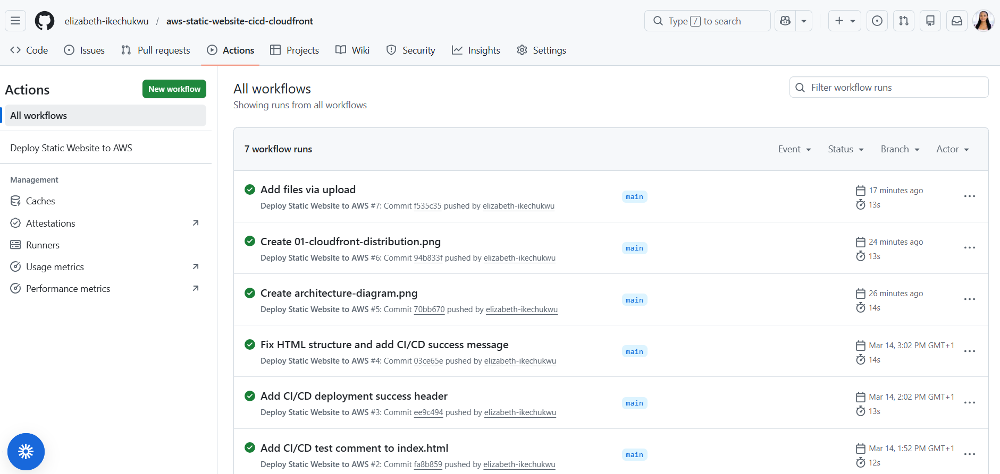
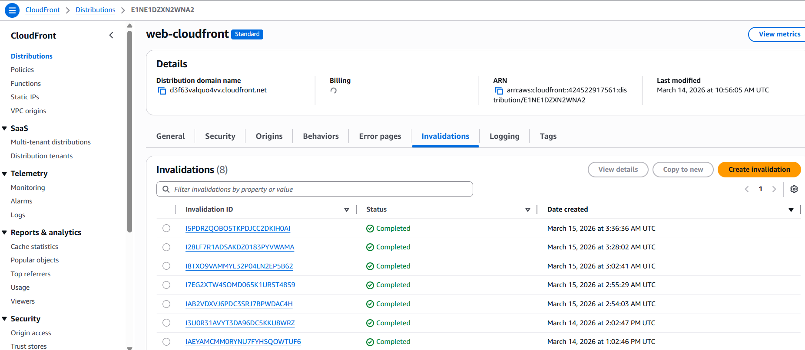
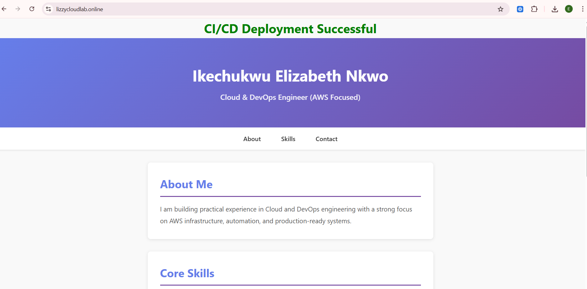

# AWS CloudFront Static Website CI/CD Platform

Live Demo: https://lizzycloudlab.online

A production-style static website delivery platform built on AWS using CloudFront CDN, a private S3 origin, and automated CI/CD with GitHub Actions.

This project demonstrates real DevOps practices including secure infrastructure design, automated deployments, and global content delivery through a CDN.

---

# Project Overview

This project implements a **secure and automated static website hosting architecture**.

Developers push code to GitHub → GitHub Actions triggers a CI/CD pipeline → files are deployed to a private S3 bucket → CloudFront CDN distributes the website globally with HTTPS.

The system ensures:

• automated deployments  
• secure private origin access  
• global content delivery  
• cache invalidation after updates  
• zero manual deployment steps

---

# Architecture Diagram

---

# Architecture Flow

1. User visits the website through a browser  
2. DNS resolves the domain via **Hostinger DNS**  
3. Traffic is routed to **AWS CloudFront CDN**  
4. CloudFront securely retrieves content from **private S3 origin (OAC restricted)**  
5. Website is delivered globally with HTTPS  
6. Developers push updates to **GitHub repository**  
7. **GitHub Actions CI/CD pipeline** deploys changes automatically  
8. Pipeline uploads updated files to **S3 bucket**  
9. **CloudFront cache invalidation** refreshes the CDN

---

# Key DevOps Features

### CI/CD Automation
GitHub Actions automatically deploys new changes whenever code is pushed to the repository.

### Secure Infrastructure
The S3 bucket is **private** and accessible only through **CloudFront Origin Access Control (OAC)**.

### Global CDN Delivery
CloudFront distributes the website through AWS edge locations worldwide.

### HTTPS Encryption
TLS certificates are managed through **AWS Certificate Manager (ACM)**.

### Cache Invalidation
CloudFront cache is automatically invalidated after deployment to ensure users always see the latest version.

---

# Technologies Used

- AWS S3
- AWS CloudFront
- AWS Certificate Manager (ACM)
- AWS IAM
- GitHub Actions
- HTML / CSS
- DNS (Hostinger)

---

## Project Evidence

### CloudFront Distribution

### Private S3 Bucket (Block Public Access Enabled)

### GitHub Actions CI/CD Deployment

### CloudFront Cache Invalidation

### Live Website

---

# Repository Structure
├── .github/workflows
│ └── deploy.yml
├── architecture
│ └── aws-static-website-cicd-architecture.png
├── screenshots
│ ├── 01-cloudfront-distribution.png
│ ├── 02-s3-private-bucket.png
│ ├── 03-github-actions-success.png
│ ├── 04-cloudfront-invalidation.png
│ └── 05-live-website.png
├── index.html
├── style.css
└── README.md

---

# Key Learning Outcomes

Through this project I practiced:

- designing secure AWS architectures
- implementing CI/CD pipelines
- automating deployments with GitHub Actions
- configuring CloudFront CDN
- securing S3 origins using OAC
- managing cache invalidation for production deployments

---

# Author

Ikechukwu Elizabeth Nkwo  
Cloud / DevOps Engineer (AWS)

GitHub: https://github.com/elizabeth-ikechukwu
